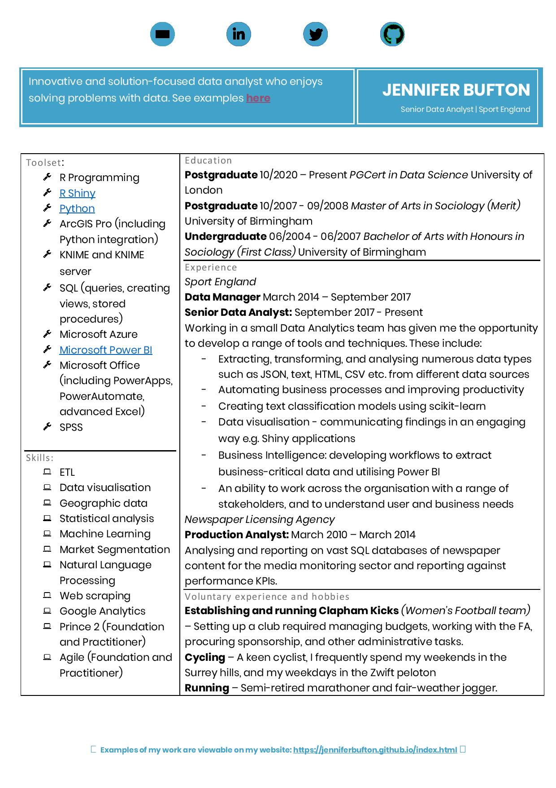

<center>
<div style="width:400px; height:300px">

[](https://raw.githubusercontent.com/jenniferbufton/jenniferbufton.github.io/master/input/CV_20210106.pdf)

</div>
</center>
 
```{r setup, include=FALSE}
knitr::opts_chunk$set(echo = TRUE)
```


